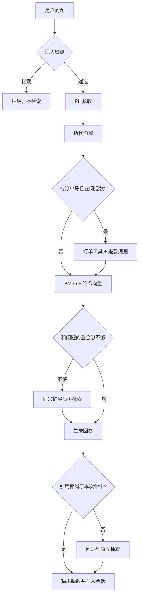

# Citadel

面向客服问答的知识 Agent。问题先过安全策略，再决定是查订单还是查知识库。知识库走 BM25 和哈希向量的混合检索，答不上来就改写查询再查一次。回答必须引用本次检索到的切片，引用对不上就丢弃生成结果，回退到原文抽取。

默认回答器是可复现的抽取式实现，不调用外部模型。检索、排序、退款判断、脱敏和评测都可以离线跑完。

资料是虚构的云厂商「北辰云」。

## 简历上可以怎么写

个人项目。适合和 Crewline 一起投 Agent 开发、RAG、LLM 应用岗位：一个讲编排和工具权限，一个讲检索、引用和安全。

**Citadel 企业知识 Agent｜个人项目｜Python**

独立实现一条 Agentic RAG 链路：输入防护、指代消解、订单工具、混合检索、查询改写、引用校验和会话记忆按固定顺序执行。退款结论来自订单数据和政策规则，不让生成步骤做算术。

- 自研分块、BM25、特征哈希向量和 RRF 融合。稠密召回是可替换接口，换成真实 embedding 时检索器的调用方不用改。
- 检索落地不足时自动扩展同义查询并再检索一次。知识库没有依据时明确拒答，避免把不相关切片编成答案。
- 订单号加退款意图会调用订单工具，再引用退款政策切片。已开票、超过 7 天、查无此单三条路径都有确定性结果。
- 提示注入在检索前拦截；邮箱、手机号、身份证号在进入记忆和输出前脱敏。
- 回答里的 `[[切片编号]]` 必须属于本次命中集合，否则整段回答作废并回退到抽取式结果。
- 内置 12 个离线用例，覆盖定价、SLA、加密、事故、三条退款、查无此单、注入、隐私、超纲拒答和多轮指代。

可直接粘贴的版本见 [RESUME.md](RESUME.md)。

## 架构



## 模块

| 模块 | 职责 |
| --- | --- |
| `chunk.py` | 按段落分块，超长段落按窗口切，窗口之间保留重叠 |
| `bm25.py` | Okapi BM25 |
| `dense.py` | 特征哈希向量和余弦相似度 |
| `rrf.py` | 倒数排名融合 |
| `index.py` | 两路召回合成一个 `search()` |
| `guard.py` | 提示注入拦截，邮箱 / 手机号 / 身份证脱敏 |
| `memory.py` | 会话记忆。出现「它 / 这个 / 刚才」时接上上一轮问题 |
| `orders.py` | 订单查询和退款规则 |
| `answer.py` | 抽取式回答、引用解析、引用校验 |
| `agent.py` | 把上面的步骤收成一条固定流水线 |
| `eval.py` | 答案命中、检索命中、拦截和隐私泄漏 |

## 设计取舍

退款不交给模型算。订单状态、是否开票、是否超过 7 天，都是结构化字段，规则写死后，答案可以逐字断言。知识库只负责提供可引用的政策原文。

引用校验放在回答之后。无论后面换成哪家模型，只要输出了不存在的切片编号，这轮回答就作废。抽取式回答是校验失败时的退路，也是没有 API Key 时的默认路径。

哈希向量不是语义模型。它用来把「稠密召回 + 融合」的接口和评测先固定下来。面试时可以说清楚：替换 `HashingEmbedder.embed()` 即可接入 bge 或其他 embedding，BM25 和 RRF 不用动。

## 环境

Python 3.11 及以上。运行时没有第三方依赖。

```powershell
cd citadel
python -m pip install -e ".[dev]"
python -m pytest -q
python -m citadel
```

`python -m citadel` 会打印定价、退款、注入拦截、隐私脱敏、多轮指代和评测摘要。

## 知识库和订单

`src/citadel/data/kb/` 里是定价、可用性、加密、事故复盘和退款政策。`orders.json` 里有三笔订单：

| 订单 | 结果 |
| --- | --- |
| ORD-1001 | 已支付、未开票、2 天，可以全额退款 |
| ORD-1002 | 已开票，不支持退款 |
| ORD-1003 | 已下单 12 天，超过 7 天，不支持退款 |

## 面试时可以展开的点

- 为什么要两路召回：词法对专有名词稳，向量接口留给语义改写。RRF 不用先把两套分数归一化。
- 为什么拒答：最高分切片和问题几乎没有词面重合时，继续生成只会编造。
- 工具和检索怎么配合：工具给结构化结论，检索给必须出现在回答里的政策依据。
- 安全边界放在哪一层：注入在检索之前拦，避免恶意问题把内部文档带进上下文；脱敏在写入记忆之前做，避免下一轮把隐私又拼回去。

## 测试

```powershell
python -m pytest -q
```

覆盖 BM25 排序、RRF、分块重叠、查询改写、错误引用回退、三条退款路径、注入拦截、隐私脱敏、多轮指代、超纲拒答，以及内置评测集。

## 配套项目

[Crewline](https://github.com/wang872/crewline) 是同一个作品集里的多 Agent 运行时：状态图编排、工具权限、人工审批和轨迹。两个仓库可以分开写进简历。

## 许可

MIT
